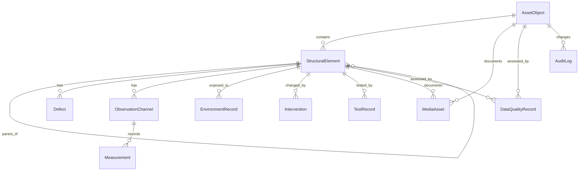

# Domain Model

СКДО строится вокруг объекта эксплуатации и его наблюдаемого состояния.

## Сущности

- `AssetObject` — паспорт объекта.
- `StructuralElement` — иерархия система → подсистема → элемент → зона.
- `Defect` — дефекты и повреждения с локализацией.
- `ObservationChannel` и `Measurement` — каналы и наблюдения/временные ряды.
- `EnvironmentRecord` — среда и эксплуатационные воздействия.
- `Intervention` — ремонты, усиления, замены и ограничения.
- `TestRecord` — испытания и НК.
- `MediaAsset` — метаданные файлов и привязка к сущностям.
- `DataQualityRecord` — точность, полнота, повторяемость, трассируемость.
- `AuditLog` — журнал изменений и импортов.

## ER-диаграмма

## Ключевые доменные правила

- любая запись должна иметь временную метку;
- любая запись должна иметь источник и единицы измерения, если это измерение;
- дефекты и наблюдения должны быть привязаны к элементу;
- для подготовки к идентификации обязательны P0-параметры и желательно P1;
- сырые наблюдения и производные дескрипторы разделяются типом `measurement_class`.

