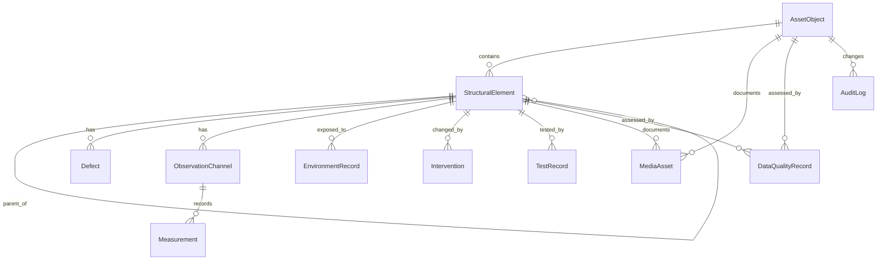

# Domain Model

СКДО строится вокруг объекта эксплуатации и его наблюдаемого состояния.

## Сущности

- `AssetObject` — паспорт объекта.
- `StructuralElement` — иерархия система → подсистема → элемент → зона.
- `Defect` — дефекты и повреждения с локализацией.
- `ObservationChannel` и `Measurement` — каналы и наблюдения/временные ряды.
- `EnvironmentRecord` — среда и эксплуатационные воздействия.
- `Intervention` — ремонты, усиления, замены и ограничения.
- `TestRecord` — испытания и НК.
- `MediaAsset` — метаданные файлов и привязка к сущностям.
- `DataQualityRecord` — точность, полнота, повторяемость, трассируемость.
- `AuditLog` — журнал изменений и импортов.

## Инженерные блоки элемента

Каждый `StructuralElement` в версии 1.1 интерпретируется не только как запись каталога,
но и как объект расчётной схемы. Для этого данные элемента группируются по блокам:

- геометрия и схема;
- проектный материал;
- фактический материал;
- закрепления и связи;
- дефекты и повреждения;
- наблюдаемые отклики;
- среда и эксплуатация;
- ремонты, усиления и испытания.

В экспортном `ElementStateObservationRecord` эти блоки представлены явно через:

- `design_geometry`
- `design_material`
- `actual_material`
- `boundary_conditions`
- `data_coverage`
- `critical_missing_data_list`

## ER-диаграмма

## Ключевые доменные правила

- любая запись должна иметь временную метку;
- любая запись должна иметь источник и единицы измерения, если это измерение;
- дефекты и наблюдения должны быть привязаны к элементу;
- для подготовки к идентификации обязательны P0-параметры и желательно P1;
- сырые наблюдения и производные дескрипторы разделяются типом `measurement_class`.
- индекс информационной достаточности строится по покрытийной, а не бинарной логике;
- отчёт готовности формируется по целям идентификации: геометрия, жёсткость, повреждения, материал, закрепления.

## Расширение A/G

### Смысловые поля элемента

У `StructuralElement` добавлены поля, которые помогают ранжировать элементы для обследования и идентификации:

- `role_criticality` — инженерная важность элемента;
- `consequence_class` — класс последствий отказа;
- `identification_priority` — приоритет для последующего расчёта;
- `degradation_mechanisms` — список ожидаемых механизмов деградации.

### Параметризованные дефекты

У `Defect` добавлены специализированные поля для разных семейств материалов.

Для стали:

- `material_family = "steel"`
- `element_classifier`
- `corrosion_depth`
- `section_loss_percent`
- `weld_damage_type`
- `bolt_condition`
- `local_buckling_flag`
- `fatigue_crack_length`

Для железобетона:

- `material_family = "concrete"`
- `crack_type`
- `cover_loss_area`
- `rebar_corrosion_class`
- `carbonation_depth`
- `bond_loss_flag`

Эти поля добавлены в additive-режиме: старые payload и старые маршруты остаются рабочими.
